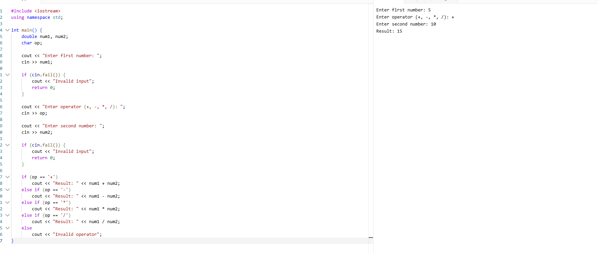

# Basic Calculator

A simple C++ console calculator created for Assignment 2.

## Features

- Addition, subtraction, multiplication, and division
- Division-by-zero protection
- Validation for invalid numeric input
- Validation for unsupported operators
- Repeated calculations without restarting the application

## Files

- `calculator.cpp` - final calculator program
- `input-validation.c++` - original input-validation development version
- `image.png` - project screenshot

## Required Branches

- `feature/basic-calculator`
- `feature/input-validation`
- `docs/update-readme`

## Compile and Run

### Windows

```bash
g++ calculator.cpp -o calculator.exe
calculator.exe
```

### Linux or macOS

```bash
g++ calculator.cpp -o calculator
./calculator
```

## Example

```text
Enter first number: 10
Enter operator (+, -, *, /): +
Enter second number: 5
Result: 15
Do you want another calculation? (y/n): y
```

## Screenshot


